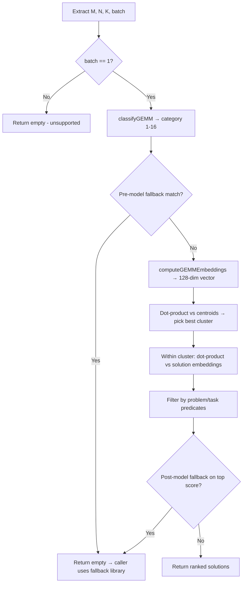

# GFX950 EmbeddingSimilarity Libraries

This document describes the **EmbeddingSimilarity** solution-selection libraries for gfx950, covering the YAML format, C++ data structures they deserialize into, the neural encoder architecture, solution embedding layout, and fallback rules.

## YAML Files Covered

| File | Path | Problem |
|------|------|---------|
| **BBS_BH** | `gfx950/Embedding/gfx950_Cijk_Alik_Bljk_BBS_BH_BiasSB_HAS_SAV_UserArgs.yaml` | BF16 TN GEMM with bias, scale-alpha vector, activation, high-precision accumulate |
| **S_MX_B** | `gfx950_id75a3/Embedding/gfx950_Cijk_Ailk_Bjlk_S_MX_B_BiasS_HAS_SAV_UserArgs.yaml` | FP32 NT GEMM with MX block scaling, bias, scale-alpha vector, activation |

Both files declare `LibraryType: EmbeddingSimilarity` and target `ArchitectureName: gfx950`.

---

## Summary Statistics

| Property | BBS_BH (Alik/Bljk) | S_MX_B (Ailk/Bjlk) |
|----------|-------------------|-------------------|
| **Solutions** | 1,647 (indices 0–1646) | 1,148 (indices 0–1147) |
| **Encoder input features** | **141** | **192** |
| **Encoder output (embedding) dim** | **128** | **128** |
| **Hidden layers** | 3 (256 → 384 → 256, ReLU) | 3 (256 → 384 → 256, ReLU) |
| **Clusters (centroids)** | 1 | 1 |
| **Solutions per cluster** | 1,647 | 1,148 |
| **Pre-model fallback rules** | 6 | 8 |
| **Post-model fallback rules** | 8 | 0 |
| **Quantization (BF16 weights)** | No | No |
| **`dtype_size` (HW constant)** | 2 (BF16) | 4 (FP32) |
| **`peak_flops` (HW constant)** | 2.3×10¹⁵ | 1.573×10¹⁴ |

> **Note:** The raw YAML files do not contain a `Library.table` field. At load time, Tensile synthesizes `table: [0, len(Solutions)]` (see `LibraryIO.parseLibraryLogicData`), mapping solution indices 0…N−1 to the `Solutions` list.

---

## Top-Level YAML Structure

```yaml
MinimumRequiredVersion: 5.0.0
LibraryType: EmbeddingSimilarity
PerfMetric: DeviceEfficiency
ScheduleName: gfx950
ArchitectureName: gfx950
DeviceNames: [Device 75a0]
ProblemType: { ... }          # GEMM problem descriptor
Library:
  fallback: { ... }           # Pre/post-model fallback rules
  hardware_constants: { ... } # Device parameters for feature engineering
  encoder: { ... }            # StandardScaler + MLP weights
  solution_embeddings: { ... }# Precomputed solution/centroid vectors
Solutions: [ ... ]            # Full kernel solution definitions
```

---

## C++ Data Structures (Deserialization)

YAML is deserialized via `TensileLite::Serialization` mapping traits into `EmbeddingSimilarityLibrary<MyProblem, MySolution>`.

### Library container

**Header:** `tensilelite/include/Tensile/EmbeddingSimilarityLibrary.hpp`

```cpp
template <typename MyProblem, typename MySolution>
struct EmbeddingSimilarityLibrary : public SolutionLibrary<MyProblem, MySolution>
{
    std::map<int, std::shared_ptr<MySolution>> solutionmap;  // from Library.table + Solutions
    std::vector<std::shared_ptr<MySolution>>   solutions;
    std::shared_ptr<Encoder>                   encoder;
    std::shared_ptr<SolutionEmbeddings>        embeddings;
    std::shared_ptr<HardwareConstants>         hw_constants;
    std::shared_ptr<FallbackRules>             fallback_rules;
    bool                                       is_quantized_ = false;
};
```

**Serialization mapping** (`tensilelite/include/Tensile/Serialization/EmbeddingSimilarityLibrary.hpp`):

| YAML key | C++ field | Type |
|----------|-----------|------|
| `table` | `solutionmap` / `solutions` | `[startIndex, count]` → solution index list |
| `encoder` | `encoder` | `EmbeddingSimilarity::Encoder` (optional at load; not serialized on write) |
| `solution_embeddings` | `embeddings` | `EmbeddingSimilarity::SolutionEmbeddings` (optional at load; not serialized on write) |
| `hardware_constants` | `hw_constants` | `EmbeddingSimilarity::HardwareConstants` (optional at load; not serialized on write) |
| `fallback` | `fallback_rules` | `EmbeddingSimilarity::FallbackRules` (optional; not serialized on write) |
| `quantize` | triggers `quantize()` | `bool` (optional) |

### Encoder network

**Header:** `tensilelite/include/Tensile/EmbeddingSimilarity.hpp`

```cpp
struct StandardScaler {
    std::vector<float> mean, scale;   // YAML: encoder.scaler.mean / .scale
};

struct Network {
    std::vector<std::vector<float>> weights_;      // YAML: encoder.state_dict.weights (flat per layer)
    std::vector<std::vector<float>> bias_;         // YAML: encoder.state_dict.bias
    std::vector<float>              proj_weights_; // YAML: encoder.state_dict.proj_weights
    std::vector<float>              proj_bias_;    // YAML: encoder.state_dict.proj_bias
};

struct Encoder {
    StandardScaler scaler;
    Network        network;
};
```

**Forward pass** (`tensilelite/src/EmbeddingSimilarity.cpp`):

1. `StandardScaler`: `(x - mean) / scale`
2. Three dense layers with ReLU: input → 256 → 384 → 256
3. Linear projection: 256 → **128** (output embedding, no activation)

Both models share the same hidden topology; only the input dimension differs (141 vs 192).

### Solution embeddings

```cpp
struct SolutionEmbeddings {
    std::vector<std::vector<float>>              centroids;        // cluster centroids
    std::vector<std::vector<std::vector<float>>> embeddings;      // per-cluster solution vectors
    std::vector<std::vector<int>>                cluster_indices; // maps cluster slot → solution index
    // Optional BF16 quantized copies: centroids_bf16, embeddings_bf16
};
```

| YAML key | C++ field |
|----------|-----------|
| `centroids` | `centroids` |
| `embeddings` | `embeddings` |
| `cluster_indices` | `cluster_indices` |

For both gfx950 libraries, there is **1 cluster** containing **all** solutions. Centroids and per-solution embeddings are **128-dimensional** (matching encoder output).

### Hardware constants

```cpp
struct HardwareConstants {
    int   n_cu;        // 256
    float peak_flops;  // architecture peak FLOPS
    float mem_bw;      // 8×10¹²
    float l1_size;     // 32768
    float l2_size;     // 4194304
    float l3_size;     // 268435456
    float wave_size;   // 64
    float dtype_size;  // element size in bytes (2 for BF16, 4 for FP32)
    float acc_size;    // 4
};
```

These values feed into runtime feature computation (roofline, cache pressure, wave alignment, etc.).

### Fallback rules

```cpp
struct FallbackRules {
    std::string interval_semantics;              // "open_open"
    std::string notes;
    std::vector<int> all_cats;                   // valid GEMM category IDs
    std::vector<FallbackRule> pre_model_features;     // checked before encoder
    std::vector<FallbackPostRule> post_model_features; // checked after similarity scoring
};

struct FallbackRule {          // pre-model
    int rule_id;
    std::vector<float> m_ranges_, n_ranges_, k_ranges_;  // [lo, hi] pairs
    std::vector<int>   cats_;
};

struct FallbackPostRule : FallbackRule {  // post-model adds score
    std::vector<float> score_ranges_;
};
```

Interval semantics use **open-open** bounds: `value > low && value < high` (`TensileLite::Fallback::OpenOpen`). An **empty** `m`, `n`, `k`, `cats`, or `score` list acts as a wildcard (always matches that dimension). Within a rule, all specified dimensions must match (**AND**). Rules are evaluated in order; the **first matching rule** triggers fallback.

---

## Runtime Selection Algorithm

Implemented in `EmbeddingSimilarityLibrary::findTopSolutions`:



**Similarity metric:** Inner product (dot product) between the query embedding and stored solution/centroid vectors. Higher score = better match.

**Fallback behavior:** Returning an empty solution vector signals the caller (hipBLASLt/Tensile master library) to use an alternate selection path (e.g., ExactLogic or another library tier).

---

## Feature Engineering (Encoder Input)

Features are computed at runtime in `computeGEMMEmbeddings()` from problem dimensions, strides, batch count, transpose layout, and `HardwareConstants`.

### Input dimension by layout

| Layout | Transpose | Input features | Notes |
|--------|-----------|----------------|-------|
| **TN** (BBS_BH: Alik/Bljk) | A=T, B=N | **141** | Base feature set only |
| **NT** (S_MX_B: Ailk/Bjlk) | A=N, B=T | **192** | Base + 51 NT-specific features |

The NT-specific block adds features for extreme aspect ratios, dimension dominance, micro-GEMM detection, vectorization misalignment, pathological cases, etc. (see `EmbeddingSimilarityLibrary.hpp`, `is_NT` branch).

### Feature categories (base set, ~141 features)

- **Log-transformed raw inputs:** M, N, K, LDA/LDB/LDC/LDD, strides, batch count
- **Roofline / intensity:** FLOPs, bytes moved, arithmetic intensity, compute-bound flag
- **Cache hierarchy:** working-set ratios vs L1/L2/L3, fit flags, sweet-spot indicators
- **K-dimension pressure:** wave utilization, parallelism
- **Wave alignment:** M/N misalignment modulo wave size (64)
- **Tile geometry:** wastage at 32/64/128/192/224/256, partial tiles, modulo alignment
- **Shape flags:** tall/wide/deep-K, tiny/small dimensions, aspect ratios
- **Occupancy proxies:** estimated tile count vs CU count

All features are standardized by the trained `StandardScaler` before entering the MLP.

---

## GEMM Category Classification (for Fallback)

Before fallback rules run, `classifyGEMM(m, n, k, batch)` assigns one of 16 categories (checked in priority order):

| Cat | Description | M range | N range | K range |
|-----|-------------|---------|---------|---------|
| 1 | Small GEMMs | 2–1024 | 2–1024 | 2–1024 |
| 3 | Large GEMMs | 4094–8192 | 4096–8192 | 4096–8192 |
| 2 | Medium GEMMs | 2–8192 | 2–8192 | 2–8192 |
| 5 | Large M, tiny N/K | ≥8193 | 2–128 | 2–128 |
| 4 | Large M, smaller N/K | ≥8193 | 2–8192 | 2–8192 |
| 7 | Large N, tiny M/K | 2–128 | ≥8193 | 2–128 |
| 6 | Large N, smaller M/K | 2–8192 | ≥8193 | 2–8192 |
| 9 | Large K, tiny M/N | 2–128 | 2–128 | ≥8193 |
| 8 | Large K, smaller M/N | 2–8192 | 2–8192 | ≥8193 |
| 10 | Large M and N | ≥8193 | ≥8193 | 2–8192 |
| 11 | Large N and K | 2–8192 | ≥8193 | ≥8193 |
| 12 | Large M and K | ≥8193 | 2–8192 | ≥8193 |
| 13 | Very large (all dims) | ≥8193 | ≥8193 | ≥8193 |
| 14 | M = 1 | 1 | any | any |
| 15 | N = 1 | any | 1 | any |
| 16 | K = 1 | any | any | 1 |

Categories 17–20 (batch-size variants) exist in code but are not listed in `all_cats` for these YAML files.

---

## Fallback Rules Detail

### BBS_BH — 6 pre-model, 8 post-model

**Pre-model** (skip embedding model entirely):

| rule_id | M | N | K | Categories | Intent |
|---------|---|---|---|------------|--------|
| 1 | * | (41.5, 48.5) | (40, ∞) | {5} | Large-M tiny-N/K with mid-range N |
| 2 | (3400, 5120) | (2488, ∞) | (85270, ∞) | {1,3,4,6–16} | Mid-M, large N/K |
| 3 | (1000, ∞) | (−∞, 1536) | (18620, 85270) | {12} | Large M+K, small N |
| 4 | (−∞, 1000) | (25310, ∞) | * | {11} | Small M, very large N |
| 5 | (1000, 3400) | (2488, 4824) | (85270, ∞) | {1,3,4,6–16} | Mid-size M/N, huge K |
| 6 | (−∞, 3432) | (3080, 5800) | * | {8} | Large K profile, mid N |

**Post-model** (after top similarity score computed; reject if top score in range):

| rule_id | M | N | K | Score | Categories |
|---------|---|---|---|-------|------------|
| 1–2 | (−∞, 7960) | (4608, 7212) | (−∞, 404400) | (15.14, ∞) | most |
| 3 | (129, 194) | * | (−∞, 18980) | (−∞, 15.14) | most |
| 4 | (7560, ∞) | (1513, ∞) | (18980, ∞) | (−∞, 15.14) | most |
| 5 | * | (7212, 8704) | * | (17.14, ∞) | {11} |
| 6 | (9712, ∞) | (−∞, 1513) | (18980, ∞) | (−∞, 15.14) | most |
| 7 | (256.5, 4416) | (−∞, 1513) | (18980, ∞) | (−∞, 15.14) | most |
| 8 | * | (3080, 5800) | (55310, ∞) | (−∞, 16.47) | {1–8,10–16} |

### S_MX_B — 8 pre-model, 0 post-model

**Pre-model only** (no post-model score rejection for this problem type):

| rule_id | M | N | K | Categories | Intent |
|---------|---|---|---|------------|--------|
| 1 | (832, 1568) | (−∞, 6.5) | (4048, ∞) | * (any) | Mid-M, tiny N, large K |
| 2 | (1568, 2888) | (64.5, 495.5) | (3576, ∞) | * | Mid-M/N, large K |
| 3 | (34, 114) | (38430, ∞) | * | {6} | Small M, huge N |
| 4 | (34, 114) | (8936, 38430) | * | {6} | Small M, very large N |
| 5 | (8.5, 127.5) | (−∞, 24.5) | * | {2} | Small GEMM, tiny N |
| 6 | (36.5, 255.5) | (1072, 2302) | * | {1,3–5,7–16} | Small M, mid N |
| 7 | * | (3928, ∞) | (590700, ∞) | {8} | Large K, large N |
| 8 | (6832, 893000) | (134700, ∞) | (984, 14470) | {1–7,9–16} | Extreme aspect ratio |

---

## Problem Type Differences

### BBS_BH (`Cijk_Alik_Bljk_BBS_BH`)

- **DataType:** 7 (BFloat16)
- **Layout:** TN (`TransposeA: true`, `TransposeB: false`)
- **HighPrecisionAccumulate:** true
- **BiasDataTypeList:** [0, 7]
- **UseScaleAlphaVec:** 1
- **Device:** gfx950 (75a0)

### S_MX_B (`Cijk_Ailk_Bjlk_S_MX_B`)

- **DataType:** 0 (FP32)
- **Layout:** NT (`TransposeA: false`, `TransposeB: true`)
- **F32XdlMathOp:** 10 (MX block math)
- **TLUA/TLUB:** true (tensor layout unroll)
- **BetaOnlyUseBias:** true
- **Device:** gfx950_id75a3 variant (75a0 in DeviceNames)

---

## Key Source Files

| File | Purpose |
|------|---------|
| `tensilelite/include/Tensile/EmbeddingSimilarityLibrary.hpp` | Library template, feature engineering, selection logic |
| `tensilelite/include/Tensile/EmbeddingSimilarity.hpp` | Encoder, Network, SolutionEmbeddings, FallbackRules structs |
| `tensilelite/include/Tensile/Serialization/EmbeddingSimilarityLibrary.hpp` | YAML ↔ C++ mapping |
| `tensilelite/src/EmbeddingSimilarity.cpp` | MLP forward pass, StandardScaler, AVX dot products |
| `tensilelite/include/Tensile/Fallback.hpp` | Interval and category rule matching |
| `tensilelite/Tensile/LibraryIO.py` | Synthesizes `table: [0, N]` at parse time |
| `tensilelite/Tensile/SolutionLibrary.py` | Python-side EmbeddingSimilarityLibrary wrapper |

---

## Validation Checks at Load Time

The deserializer enforces:

1. `hardware_constants` must be valid (positive n_cu, peak_flops, mem_bw)
2. `embeddings.size()` (unique solution indices) == `solutions.size()`
3. `encoder.network.proj_bias_.size()` == solution embedding dimension (128)
4. Fallback rules must pass structural validation if present
5. Projection output dimension must be divisible by 4

---

## Future Plan: Split Storage and Shared NN Data

Today, each EmbeddingSimilarity library is a **monolithic YAML** under `gfx950/*/Embedding/` containing `ProblemType`, `Solutions`, and the full `Library` block (encoder weights, solution embeddings, fallback rules, hardware constants). That works for shipping but is hard to version, diff, and retrain independently of kernel logic.

The planned layout **splits** this into three artifacts and **centralizes ML data** under shared Origami, mirroring the existing **tilewright (TWREC)** pattern.

### Target file layout

```
Tensile/Logic/asm_full/gfx950/.../Embedding/
  {stem}.logic.yaml              # TensileLite logic only (kernels + ProblemType)

shared/origami/data/nn/
  tilewright/gfx950/
    origami_nn_index
    *.tilewright.yaml
    *.tilewright.wts.yaml
  embedding_similarity/gfx950/
    origami_nn_index
    *.embedding.yaml             # ESREC_v1 manifest
    *.embedding.wts.yaml         # ESREC_WTS_v1 weights sidecar
```

| Artifact | Location | Contents |
|----------|----------|----------|
| **Logic YAML** | `Tensile/Logic/asm_full/...` | `ProblemType`, `Solutions`, `LibraryType: EmbeddingSimilarity` |
| **Manifest** | `shared/origami/data/nn/embedding_similarity/...` | Fallback rules, hardware constants, cluster map, model topology, `weights_hash` |
| **Weights sidecar** | Same directory as manifest | `encoder` (scaler + MLP) and `solution_embeddings` tensors |

**Stem rule:** `{ScheduleName}_{ProblemIdentifier}` — identical to tilewright naming (e.g. `gfx950_Cijk_Alik_Bljk_BBS_BH_BiasSB_HAS_SAV_UserArgs`).

### TensileLite logic YAML (list format)

Logic files will use the standard **12-element list format** (same as Origami/Prediction), not the monolithic dict layout:

| Index | Field |
|-------|-------|
| `[0]` | `{MinimumRequiredVersion}` |
| `[1]` | `ScheduleName` |
| `[2]` | `ArchitectureName` (or `{Architecture, CUCount}`) |
| `[3]` | `DeviceNames` |
| `[4]` | `ProblemType` |
| `[5]` | `Solutions` |
| `[6–8]` | `null` (indexOrder, exactLogic, rangeLogic) |
| `[9]` | `null` (reserved for tile-aware selection in standard Tensile schema) |
| `[10]` | `PerfMetric` |
| `[11]` | `EmbeddingSimilarity` |

The logic file **does not embed ML weights** and **does not point to the manifest**. Manifest resolution is handled by the registry (below), same as tilewright.

At load time, Tensile still synthesizes `Library.table: [0, len(Solutions)]` from the solutions list.

### Registry (`origami_nn_index`)

Both tilewright and embedding_similarity backends register via a shared index file per arch:

```
# origami_nn_index: <logic_stem>  <backend>  <weights_manifest>
# backend: tilewright | embedding_similarity

TensileLibrary_..._Alik_Bljk_..._ID75a0_gfx950 \
  embedding_similarity \
  gfx950_Cijk_Alik_Bljk_BBS_BH_BiasSB_HAS_SAV_UserArgs.embedding.yaml
```

The loader resolves the manifest path relative to `shared/origami/data/nn/embedding_similarity/{arch}/`, reads the sidecar named in `weights_sidecar`, and reconstructs the in-memory `EmbeddingSimilarityLibrary` (same C++ types as today's monolithic `Library:` block).

### ESREC manifest vs sidecar

| File | Format | Role |
|------|--------|------|
| `*.embedding.yaml` | `ESREC_v1` | Schema, metadata, fallback, hardware constants, cluster topology, feature dims |
| `*.embedding.wts.yaml` | `ESREC_WTS_v1` | Learned parameters only (encoder + solution embeddings) |

Splitting manifest from weights allows:

- Retuning fallback rules without touching tensors
- Storing weights in a compressed/encoded sidecar (Phase 2, like TWREC_WTS)
- Uniform registration of tilewright and embedding_similarity in Origami

### Interim staging

Split outputs currently live next to the monolithic sources under `gfx950/*/Embedding/` as a migration step:

- `{stem}.logic.yaml`
- `{stem}.embedding.yaml`
- `{stem}.embedding.wts.yaml`

A publish step will copy manifest + sidecar into `shared/origami/data/nn/embedding_similarity/gfx950/` and add `origami_nn_index` entries. The monolithic sources remain until the shared loader path is wired in Tensile/Origami.

### Related tooling and docs

| Resource | Path |
|----------|------|
| Split script | `gemmaiperf/benchmarking/origami/nn/embedding_similarity/split_embedding_yaml.py` |
| ESREC format spec | `gemmaiperf/benchmarking/origami/nn/embedding_similarity/ESREC_STORAGE_FORMAT.md` |
| Tilewright reference layout | `gemmaiperf/benchmarking/origami/nn/tilewright/gfx950/` |
